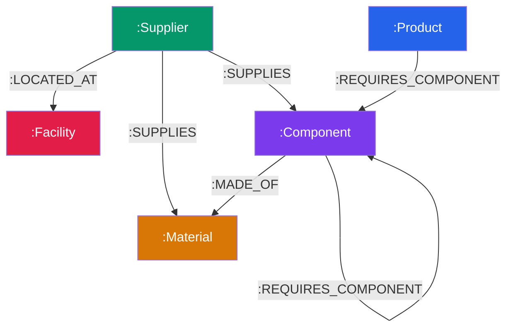

# SupplyGraph — Supply Chain Multi-Hop Dependency & Risk Engine

> A graph-powered supply-chain intelligence application for exploring multi-tier dependencies, simulating supplier disruptions, identifying bottleneck suppliers, and estimating downstream revenue at risk.

<p align="center">
  <strong>Wexa AI — CognoDB Take-Home Assignment</strong>
</p>

---

## 🚀 Live Demo

**Production Application:**

https://supply-graph-cognodb-op7ryxair-gangadharreddy065-5671s-projects.vercel.app/

## 💻 Source Code

https://github.com/gangadharreddy-dev/supply-graph-cognodb

---

# 1. Project Overview

SupplyGraph is a graph-based supply-chain dependency and risk analysis application built for the Wexa AI CognoDB take-home assignment.

The application models a technology supply chain as a connected graph containing:

- Suppliers
- Components
- Materials
- Products
- Facilities

It allows users to:

- Explore multi-tier supply-chain dependencies
- Visualize the supply-chain graph
- Simulate supplier disruptions
- Identify affected downstream products
- Trace dependency paths across multiple hops
- Estimate revenue exposure
- Identify potential bottleneck and Single Point of Failure (SPOF) suppliers
- Inspect the underlying openCypher queries
- Verify the live CognoDB backend connection

The core business question is:

> **If a supplier experiences a disruption, which downstream products are affected, how deep is the dependency path, and what revenue is potentially at risk?**

This is naturally a graph traversal problem because the impact of a supplier can propagate through multiple components, sub-components, materials, and products.

SupplyGraph uses **CognoDB Cloud** with **openCypher** over the **Bolt protocol**, accessed through the official `neo4j-driver`.

---

# 2. Why a Graph Database?

Supply chains are naturally represented as directed dependency graphs.

A simplified dependency chain looks like:

```text
Supplier
   │
   │ SUPPLIES
   ▼
Component
   │
   │ REQUIRES_COMPONENT
   ▼
Sub-Component
   │
   │ REQUIRES_COMPONENT / MADE_OF
   ▼
Component / Material
   │
   │ REQUIRES_COMPONENT
   ▼
Product
| Architectural Dimension | Relational DB (PostgreSQL) | Graph DB (CognoDB openCypher) |
| :--- | :--- | :--- |
| **Multi-Hop Traversal (2–5 Hops)** | Requires 5–7 table `JOIN`s or complex `WITH RECURSIVE` CTEs. Execution time degrades exponentially with path depth. | Expressed in a **single Cypher pattern**: `(s:Supplier)-[:SUPPLIES\|REQUIRES_COMPONENT*1..5]->(p:Product)`. Executed in milliseconds via index-free adjacency. |
| **Bottleneck & SPOF Detection** | Grouping across recursive variable-length subtrees with distinct count aggregations requires heavy memory buffer scans and temporary tables. | Solved cleanly via pattern matching: `MATCH (p:Product)-[:REQUIRES_COMPONENT*1..5]->(c:Component)<-[:SUPPLIES]-(s:Supplier)` with aggregations over distinct product nodes. |
| **Schema Flexibility** | Adding new entity types (e.g., logistics hubs, transport routes, weather risks) requires `ALTER TABLE` DDL migrations and foreign key schema updates across multiple tables. | Graph schemas are naturally flexible. New node labels and relationship types can be added dynamically without altering existing queries. |

---

## 2. Data Model Specification

### Entity Labels & Properties
- `:Product` — `{ id, name, sku, revenue, category, riskScore }`
- `:Component` — `{ id, name, code, leadTimeDays, unitCost }`
- `:Material` — `{ id, name, category, scarcityIndex }`
- `:Supplier` — `{ id, name, tier, country, reliabilityScore, status }`
- `:Facility` — `{ id, name, city, country, riskFactor }`

### Typed Relationships
- `(:Product)-[:REQUIRES_COMPONENT {quantity}]->(:Component)`
- `(:Component)-[:REQUIRES_COMPONENT {quantity}]->(:Component)` (Sub-assemblies)
- `(:Component)-[:MADE_OF {proportion}]->(:Material)`
- `(:Supplier)-[:SUPPLIES {leadTimeDays, isPrimary}]->(:Component|Material)`
- `(:Supplier)-[:LOCATED_AT]->(:Facility)`



---

## 3. Parameterized openCypher Queries

### Query 1: Disruption Blast Radius (Multi-Hop 1..5 Hops)
```cypher
MATCH (s:Supplier {id: $supplierId})
MATCH path = (s)-[:SUPPLIES|REQUIRES_COMPONENT|MADE_OF*1..5]->(p:Product)
WITH s, p, path, length(path) as depth
RETURN 
  s.id AS supplierId,
  s.name AS supplierName,
  s.tier AS supplierTier,
  p.id AS productId,
  p.name AS productName,
  p.sku AS productSku,
  p.revenue AS productRevenue,
  depth,
  [node IN nodes(path) | {
    id: node.id,
    name: coalesce(node.name, node.id),
    label: labels(node)[0]
  }] AS pathNodes
ORDER BY p.revenue DESC, depth ASC
```

### Query 2: Bottleneck SPOF Supplier Detection (Awkward in SQL)
```cypher
MATCH (p:Product)-[:REQUIRES_COMPONENT*1..5]->(c:Component)<-[:SUPPLIES]-(s:Supplier)
WITH s, count(DISTINCT p) AS affectedProductsCount, sum(DISTINCT p.revenue) AS totalRevenueAtRisk, collect(DISTINCT {id: p.id, name: p.name, revenue: p.revenue}) AS products
WHERE affectedProductsCount >= $minProducts
RETURN 
  s.id AS supplierId,
  s.name AS supplierName,
  s.tier AS supplierTier,
  s.country AS country,
  s.reliabilityScore AS reliabilityScore,
  affectedProductsCount,
  totalRevenueAtRisk,
  products
ORDER BY affectedProductsCount DESC, totalRevenueAtRisk DESC
```

---

## 4. Engineering Architecture & Project Structure

```
supplychain-graph-app/
├── package.json
├── .env.example
├── README.md
├── server/
│   ├── index.js                  # Express app entry point
│   ├── verify.js                 # Automated backend verification test suite (npm run test:verify)
│   ├── config/
│   │   └── db.js                 # Neo4j/CognoDB driver connection pool & fallback status
│   ├── controllers/
│   │   └── graphController.js    # API controller handling graph, simulation & bottleneck queries
│   ├── services/
│   │   └── cypherService.js     # openCypher query catalog
│   ├── routes/
│   │   └── api.js                # Express REST router
│   └── seed/
│       ├── seedData.json         # Real-world seed dataset (TSMC, ASML, Apple, Tesla)
│       └── seed.js               # Database seeder script
└── client/
    ├── vite.config.js
    └── src/
        ├── App.jsx
        └── components/
            ├── Header.jsx        # Navigation bar & DB status pill
            ├── BackendVerificationModal.jsx # Proof Matrix & Live Driver Test Runner
            ├── GraphView.jsx     # vis-network canvas visualization
            ├── DisruptionSimulator.jsx # Multi-hop path tracer
            ├── BottleneckAnalysis.jsx  # SPOF analysis dashboard
            └── QueryInspector.jsx      # openCypher terminal console
```

---

## 5. Local Setup & Execution Guide

### Step 1: Install Dependencies
```bash
npm install
cd client && npm install && cd ..
```

### Step 2: Configure Environment Variables
Copy `.env.example` to `.env`:
```bash
cp .env.example .env
```
Fill in your CognoDB Cloud credentials:
```env
COGNODB_URI=bolt+s://your-instance-id.databases.cognodb.cloud
COGNODB_USER=cognodb
COGNODB_PASSWORD=your-generated-password
PORT=3001
```

### Step 3: Run Automated Verification Suite
```bash
npm run test:verify
```

### Step 4: Run Database Seeder
```bash
npm run seed
```

### Step 5: Launch Application
```bash
npm run dev
```
Open ** [Live Demo : ](https://supply-graph-cognodb-op7ryxair-gangadharreddy065-5671s-projects.vercel.app/) in your browser.
