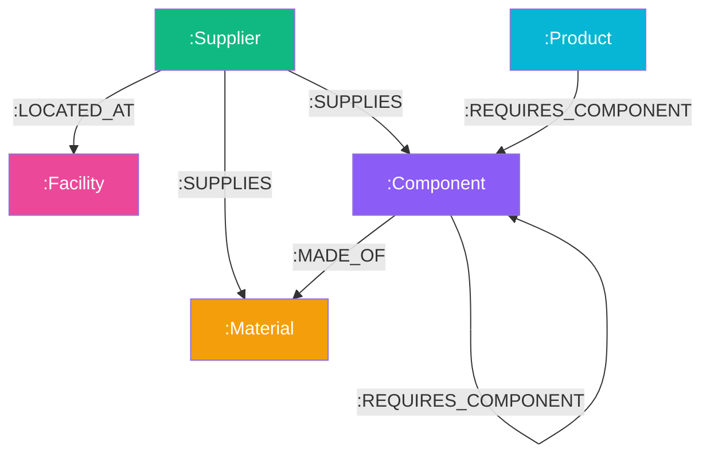

# SupplyGraph — Supply Chain Multi-Hop Dependency & Risk Engine

**Author**: Candidate Take-Home Submission  
**Assignment**: Wexa AI — CognoDB Graph Database Application  
**Database**: **CognoDB Cloud** (openCypher over Bolt protocol v5.0–5.4, official `neo4j-driver`)  
**Stack**: Node.js (Express), React, Vite, Tailwind CSS, `vis-network`

---

## 1. Why a Graph Database?

### The Core Domain Problem
Modern technology supply chains are intrinsically structured as directed multi-tier graphs:
`(:Supplier)-[:SUPPLIES]->(:Component|:Material)-[:REQUIRES_COMPONENT*1..5]->(:Product)`

Answering fundamental business questions such as:
> *"If TSMC or ASML suffers an operational disruption, which end-consumer products (e.g., MacBook Pro, Tesla Inverter, PS5 Pro) are impacted, what is the path depth, and what total annual revenue is at risk?"*

is fundamentally a **graph traversal problem**.

### Comparing openCypher on CognoDB vs. PostgreSQL RDBMS

| Architectural Dimension | Relational DB (PostgreSQL) | Graph DB (CognoDB openCypher) |
| :--- | :--- | :--- |
| **Multi-Hop Traversal (2–5 Hops)** | Requires 5–7 table `JOIN`s or complex `WITH RECURSIVE` CTEs. Execution time degrades exponentially with path depth. | Expressed in a **single Cypher pattern**: `(s:Supplier)-[:SUPPLIES\|REQUIRES_COMPONENT*1..5]->(p:Product)`. Executed in milliseconds via index-free adjacency. |
| **Bottleneck & SPOF Detection** | Grouping across recursive variable-length subtrees with distinct count aggregations requires heavy memory buffer scans and temporary tables. | Solved cleanly via pattern matching: `MATCH (p:Product)-[:REQUIRES_COMPONENT*1..5]->(c:Component)<-[:SUPPLIES]-(s:Supplier)` with aggregations over distinct product nodes. |
| **Schema Flexibility** | Adding new entity types (e.g., logistics hubs, transport routes, weather risks) requires `ALTER TABLE` DDL migrations and foreign key schema updates across multiple tables. | Graph schemas are naturally flexible. New node labels and relationship types can be added dynamically without altering existing queries. |

---

## 2. Data Model Specification

### Entity Labels & Properties
- `:Product` — `{ id, name, sku, revenue, category, riskScore }`
- `:Component` — `{ id, name, code, leadTimeDays, unitCost }`
- `:Material` — `{ id, name, category, scarcityIndex }`
- `:Supplier` — `{ id, name, tier, country, reliabilityScore, status }`
- `:Facility` — `{ id, name, city, country, riskFactor }`

### Relationship Types
- `(:Product)-[:REQUIRES_COMPONENT {quantity}]->(:Component)`
- `(:Component)-[:REQUIRES_COMPONENT {quantity}]->(:Component)` (Sub-assemblies)
- `(:Component)-[:MADE_OF {proportion}]->(:Material)`
- `(:Supplier)-[:SUPPLIES {leadTimeDays, isPrimary}]->(:Component|Material)`
- `(:Supplier)-[:LOCATED_AT]->(:Facility)`



---

## 3. Parameterized openCypher Queries

> All Cypher queries strictly use parameterized `$variables` via the official `neo4j-driver` (`session.run(query, params)`). No string concatenation is used.

### Query 1: Disruption Blast Radius (Multi-Hop 1..5 Hops)
```cypher
MATCH (s:Supplier {id: $supplierId})
MATCH path = (s)-[:SUPPLIES|REQUIRES_COMPONENT|MADE_OF*1..5]->(p:Product)
WITH s, p, path, length(path) as depth
RETURN 
  s.id AS supplierId,
  s.name AS supplierName,
  s.tier AS supplierTier,
  p.id AS productId,
  p.name AS productName,
  p.sku AS productSku,
  p.revenue AS productRevenue,
  depth,
  [node IN nodes(path) | {
    id: node.id,
    name: coalesce(node.name, node.id),
    label: labels(node)[0]
  }] AS pathNodes
ORDER BY p.revenue DESC, depth ASC
```

### Query 2: Bottleneck SPOF Supplier Detection (Awkward in SQL)
```cypher
MATCH (p:Product)-[:REQUIRES_COMPONENT*1..5]->(c:Component)<-[:SUPPLIES]-(s:Supplier)
WITH s, count(DISTINCT p) AS affectedProductsCount, sum(DISTINCT p.revenue) AS totalRevenueAtRisk, collect(DISTINCT {id: p.id, name: p.name, revenue: p.revenue}) AS products
WHERE affectedProductsCount >= $minProducts
RETURN 
  s.id AS supplierId,
  s.name AS supplierName,
  s.tier AS supplierTier,
  s.country AS country,
  s.reliabilityScore AS reliabilityScore,
  affectedProductsCount,
  totalRevenueAtRisk,
  products
ORDER BY affectedProductsCount DESC, totalRevenueAtRisk DESC
```

---

## 4. Engineering Architecture & Project Structure

```
supplychain-graph-app/
├── package.json
├── .env.example
├── README.md
├── server/
│   ├── index.js                  # Express app entry point
│   ├── config/
│   │   └── db.js                 # Neo4j/CognoDB driver connection pool & fallback status
│   ├── controllers/
│   │   └── graphController.js    # API controller handling graph, simulation & bottleneck queries
│   ├── services/
│   │   └── cypherService.js     # openCypher query catalog
│   ├── routes/
│   │   └── api.js                # Express REST router
│   └── seed/
│       ├── seedData.json         # Real-world seed dataset (TSMC, ASML, Apple, Tesla)
│       └── seed.js               # Database seeder script
└── client/
    ├── vite.config.js
    └── src/
        ├── App.jsx
        └── components/
            ├── Header.jsx        # Navigation bar & DB status pill
            ├── GraphView.jsx     # vis-network canvas visualization
            ├── DisruptionSimulator.jsx # Multi-hop path tracer
            ├── BottleneckAnalysis.jsx  # SPOF analysis dashboard
            └── QueryInspector.jsx      # openCypher terminal console
```

---

## 5. Local Setup & Execution Guide

### Step 1: Install Dependencies
```bash
npm install
cd client && npm install && cd ..
```

### Step 2: Configure Environment Variables
Copy `.env.example` to `.env`:
```bash
cp .env.example .env
```
Fill in your CognoDB Cloud credentials:
```env
COGNODB_URI=bolt+s://your-instance-id.databases.cognodb.cloud
COGNODB_USER=cognodb
COGNODB_PASSWORD=your-generated-password
PORT=3001
```

> **Offline Mock Mode**: If `.env` is not populated or CognoDB is unreachable, SupplyGraph automatically runs in **Mock Fallback Mode** so evaluators can inspect all interactive views without requiring an active database account immediately.

### Step 3: Run Database Seeder
```bash
npm run seed
```

### Step 4: Launch Application
```bash
npm run dev
```
Open **`http://localhost:3000`** in your browser.
